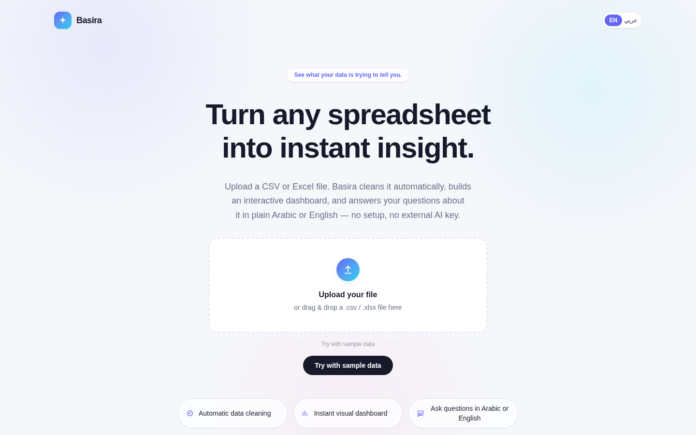
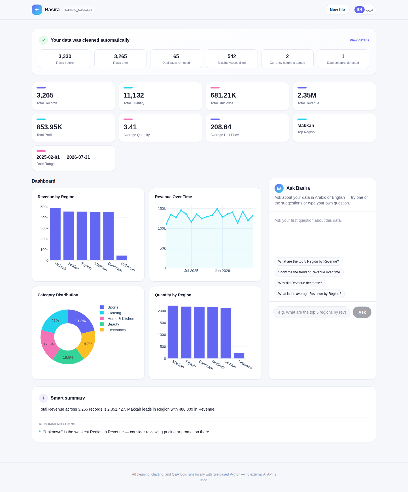
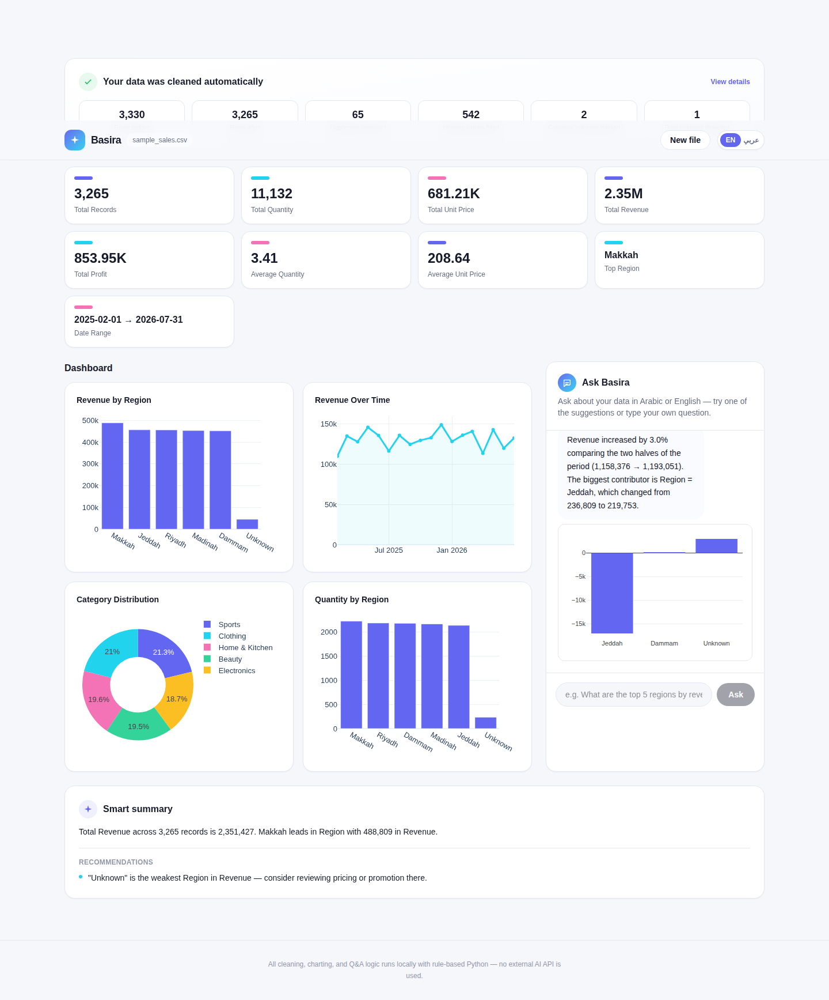
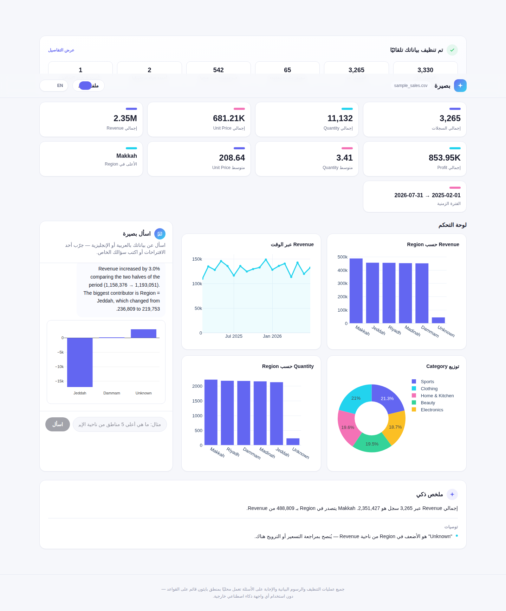
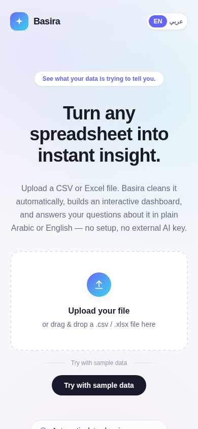
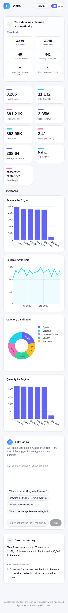

# Basira (بصيرة) — AI-Powered Data Insight Platform

Upload a messy spreadsheet. Basira cleans it automatically, builds an interactive
dashboard, and answers plain-language questions about it — in Arabic or English —
without calling any external AI API.


🎥 **[Watch the full demo video](screenshots/basira_demo.mp4)** — same walkthrough, full
resolution and speed.

## What it does

1. **Upload or try sample data.** Drop in a `.csv` / `.xlsx` / `.xls` file, or click
   "Try with sample data" to instantly explore a realistic, deliberately messy sales
   dataset bundled with the project.
2. **Automatic cleaning.** Column names are normalized, whitespace/casing artifacts
   fixed, duplicate rows dropped, currency-formatted strings (`"$909.30"`, `"SAR 347.76"`)
   parsed into numbers, date columns detected and parsed, and missing values filled
   sensibly (median for numeric columns, `"Unknown"` for categorical, left alone for
   dates). Every change is logged and shown back to the user.
3. **Instant dashboard.** KPI cards and a set of Plotly charts (top categories, trend
   over time, distribution, a second metric) are generated automatically from
   whatever shape the dataset turns out to have.
4. **Ask Basira.** A chat panel answers natural-language questions in Arabic or
   English — "what are the top 5 regions by revenue?", "لماذا انخفضت المبيعات؟",
   "compare Riyadh and Jeddah" — with a short written answer plus a supporting chart.
5. **Smart summary.** On load, Basira also writes an unprompted overview of the
   dataset and 1–3 concrete recommendations (e.g. "investigate Region 'Jeddah' — it
   dropped by 17,056 and is the largest contributor to the decline").

## Why no external AI API

The cleaning, charting, and question-answering are all **deterministic, rule-based
Python** — pandas for the data work, and a hand-built bilingual intent classifier +
column/value matcher for the natural-language layer (see `backend/app/nlq.py`). There
is no OpenAI/Groq/Claude call anywhere in the request path. That was a deliberate
scoping choice for a portfolio project: it means the whole thing runs offline, for
free, with no API key to manage, while still demonstrating real NLP-adjacent
engineering (intent classification, bilingual normalization, fuzzy column matching,
trend/contribution analysis) rather than just wrapping a chat completion.

## Screenshots

| | |
|---|---|
|  |  |
|  |  |
|  |  |

## Tech stack

- **Frontend:** Next.js 16 (App Router, TypeScript), Tailwind CSS v4, react-plotly.js
- **Backend:** FastAPI, pandas, NumPy, Plotly (server-side figure generation), openpyxl
- **No database** — sessions are held in memory for the life of the process (see
  Scoping decisions below)

## Project structure

```
dataviz-ai/
├── backend/
│   ├── app/
│   │   ├── main.py          FastAPI app + routes
│   │   ├── cleaning.py      Automatic data cleaning pipeline
│   │   ├── profiling.py     Column role detection (metric/dimension/date) + KPIs
│   │   ├── nlq.py           Bilingual rule-based query engine + smart summary
│   │   ├── charts.py        Server-side Plotly figure generation
│   │   ├── vocab.py         Arabic/English keyword + column-alias vocabulary
│   │   ├── session_store.py In-memory session store
│   │   └── schemas.py       Pydantic request models
│   ├── data/sample_sales.csv        Bundled sample dataset (deliberately messy)
│   ├── generate_sample_data.py      Script that generated the sample dataset
│   └── requirements.txt
├── frontend/
│   ├── src/app/              Next.js App Router entry (layout, page, globals.css)
│   ├── src/components/       Hero, UploadZone, KpiCards, ChartsGrid, ChatPanel, ...
│   └── src/lib/               API client, i18n (AR/EN + RTL), types, chart builder
└── screenshots/               Screenshots + demo GIF/video used in this README
```

## Running it locally

### Backend

```bash
cd backend
python3 -m venv venv
source venv/bin/activate          # Windows: venv\Scripts\activate
pip install -r requirements.txt
uvicorn app.main:app --reload --port 8000
```

The API is now at `http://localhost:8000` (interactive docs at `/docs`).

### Frontend

```bash
cd frontend
npm install
cp .env.example .env.local        # NEXT_PUBLIC_API_URL=http://localhost:8000
npm run dev
```

Open `http://localhost:3000`. Click **"Try with sample data"** for an instant demo,
or upload your own `.csv` / `.xlsx`.

## API overview

| Endpoint | Method | Description |
|---|---|---|
| `/api/health` | GET | Liveness check |
| `/api/upload` | POST (multipart) | Upload + clean a file, returns a session |
| `/api/sample` | GET | Load the bundled sample dataset the same way |
| `/api/query` | POST | `{session_id, query}` → bilingual NL answer + chart data |
| `/api/session/{id}` | GET | Refetch KPIs/charts/summary for an existing session |

## Try asking Basira things like

- "What are the top 5 regions by revenue?" / "ما هي أعلى 5 مناطق من ناحية الإيرادات؟"
- "Why did revenue decrease in Jeddah?" / "لماذا انخفضت الإيرادات في جدة؟"
- "Show me the trend of revenue over time" / "أرني اتجاه الإيرادات مع الوقت"
- "Compare Riyadh and Jeddah" / "قارن الرياض وجدة"
- "What is the average profit by category?" / "ما هو متوسط الربح حسب الفئة؟"

## Scoping decisions (and why)

This is a portfolio-scale demo, not a production SaaS — a few things were kept
intentionally simple, and are called out here rather than left as silent gaps:

- **In-memory sessions, no database, no auth.** A session lives only as long as the
  backend process does, capped at 50 concurrent sessions with a 2-hour TTL (see
  `session_store.py`). Swapping this for Redis/Postgres wouldn't touch the analysis
  logic sitting on top of it.
- **Rule-based NLQ, not a trained model.** The query engine covers a fixed set of
  intents (top/bottom-N, average, total, count, distribution, trend, compare,
  why-increased/decreased) via bilingual keyword matching rather than a general
  language model — it's transparent and fast, but a question outside that intent set
  falls back to a total/summary answer rather than failing gracefully with "I don't
  understand."
- **CORS is wide open** (`allow_origins=["*"]`) since there's no auth or per-user data
  to protect in this demo.

## Notes on the sample dataset

`data/sample_sales.csv` is synthetic but designed to exercise every part of the
pipeline: ~2% duplicate rows, ~15% whitespace/casing inconsistencies on text columns,
~20% currency-formatted number strings, ~5% missing values per column, and a genuine
injected decline (Jeddah + Electronics orders drop off sharply after Feb 2026) so that
questions like "why did revenue decrease" have a real, discoverable answer rather than
noise. Regenerate it with `python3 generate_sample_data.py` from inside `backend/`.
